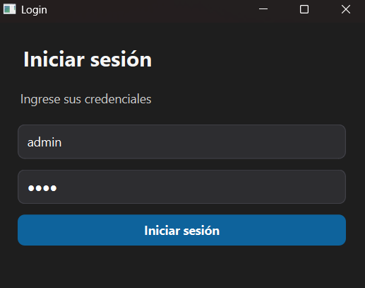
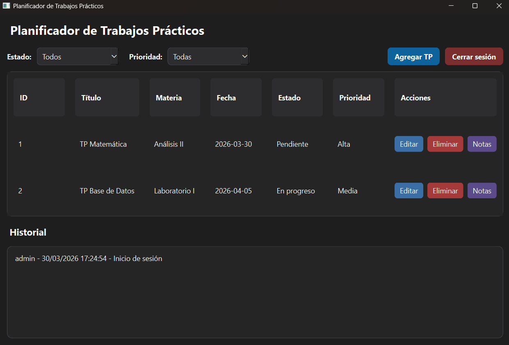
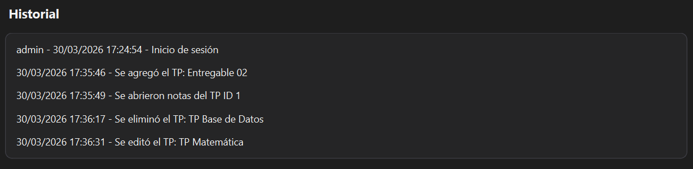

# Ejercicio 01 - Planificador de Trabajos Prácticos

Aplicación desarrollada en **C++ con Qt (QWidget)** que permite gestionar trabajos prácticos con persistencia local en archivos.

---

## Enunciado

El objetivo de este trabajo práctico es desarrollar una aplicación de escritorio que permita:

- Gestionar trabajos prácticos (crear, editar, eliminar)
- Filtrar por estado y prioridad
- Implementar persistencia local (CSV / JSON)
- Manejar sesiones de usuario
- Registrar historial de acciones
- Utilizar QWidget (sin QMainWindow)
- Mantener una correcta separación en clases

---

## Tecnologías utilizadas

- C++
- Qt (QWidget)
- Archivos CSV y JSON
- Programación orientada a objetos

---

## Estructura del proyecto

- `codigo/` → lógica de la aplicación
- `datos/` → archivos de persistencia
- `capturas/` → evidencias del funcionamiento

---

## Funcionalidades principales

- Login de usuario
- Persistencia de datos
- CRUD de tareas
- Filtros por estado y prioridad
- Historial de acciones
- Manejo de sesión activa

---

## Persistencia

La aplicación utiliza:

- `users.csv` → almacenamiento de usuarios  
- `tasks.json` → almacenamiento de tareas  
- `session.json` → gestión de sesión  

Los archivos se crean automáticamente si no existen.

---

## Funcionamiento de la aplicación

### Login
Permite ingresar con un usuario previamente registrado.

---

### Tablero de tareas
Visualización de todos los trabajos prácticos.

---

### Filtros
Permite filtrar tareas por estado y prioridad.

---

### Crear tarea
Se pueden agregar nuevas tareas al sistema.

---

### Historial
Registro de acciones realizadas por el usuario.

---

## Consideraciones

- El sistema mantiene la sesión activa por un período determinado
- Se priorizó la organización modular del código
- Se implementó persistencia sin base de datos

---

## Autor

Avril Ogas  
Ingeniería en Informática
