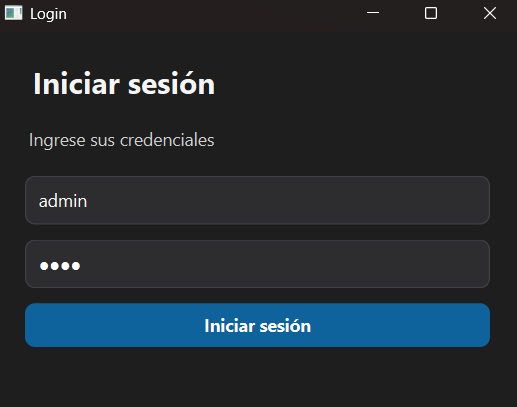
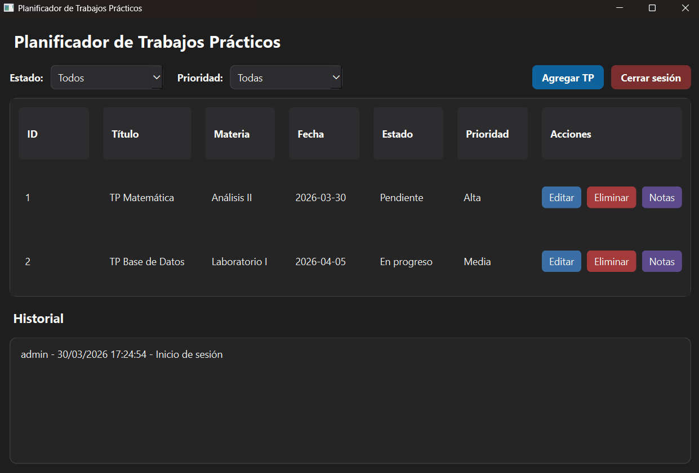
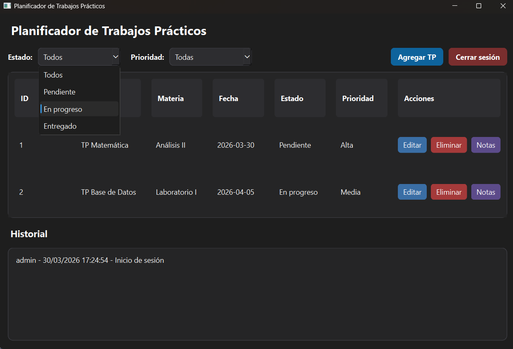
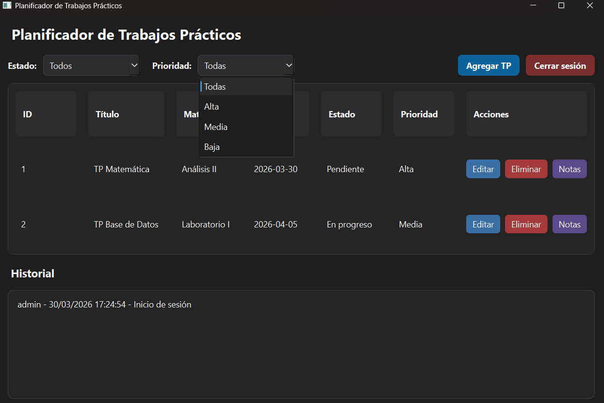
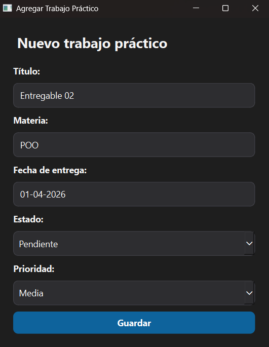
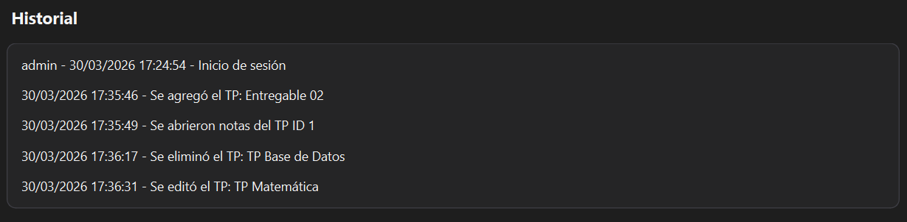

# Ejercicio 01 - Planificador de Trabajos Prácticos

## Descripción

Aplicación de escritorio desarrollada en C++ utilizando Qt Widgets que permite gestionar trabajos prácticos con persistencia local mediante archivos CSV y JSON.

El objetivo principal del ejercicio es aplicar conceptos básicos de Programación Orientada a Objetos, persistencia local, manejo de sesiones y organización modular de clases utilizando `QWidget` sin emplear `QMainWindow`.

---

## Funcionalidades principales

- Login de usuario
- Persistencia local de datos
- CRUD de trabajos prácticos
- Filtros por estado y prioridad
- Historial de acciones
- Manejo de sesión activa
- Editor de notas asociado a tareas
- Persistencia automática mediante archivos

---

## Objetivos del ejercicio

Implementar una aplicación de escritorio que permita:

- Gestionar trabajos prácticos
- Filtrar tareas por estado y prioridad
- Mantener persistencia local
- Manejar sesiones de usuario
- Registrar historial de acciones
- Organizar correctamente el proyecto mediante clases

---

## Tecnologías utilizadas

- C++
- Qt Widgets
- JSON
- CSV
- Programación Orientada a Objetos
- Persistencia mediante archivos locales

---

## Estructura del proyecto

```text
ejercicio01-Ogas/
│
├── codigo/
├── datos/
├── capturas/
└── README.md
```

---

## Persistencia

La aplicación utiliza distintos archivos locales:

| Archivo | Función |
|---|---|
| `users.csv` | Almacenamiento de usuarios |
| `tasks.json` | Persistencia de tareas |
| `session.json` | Gestión de sesión activa |

Los archivos se crean automáticamente si no existen.

---

## Funcionamiento de la aplicación

### Login

Permite ingresar con usuarios previamente registrados.



---

### Tablero de tareas

Visualización general de trabajos prácticos.



---

### Filtros

Permite filtrar tareas por estado y prioridad.





---

### Crear tarea

Se pueden agregar nuevas tareas al sistema.



---

### Historial

Registro de acciones realizadas por el usuario.



---

## Consideraciones

- El sistema mantiene la sesión activa por un tiempo determinado
- Se priorizó la organización modular del código
- Se implementó persistencia sin utilizar bases de datos

---

## Compilación y ejecución

1. Abrir el archivo `.pro` desde Qt Creator.
2. Configurar el kit de compilación.
3. Ejecutar el proyecto.

---

## Estado

✔ Ejercicio completado

---

## Autor

**Avril Ogas**  
Ingeniería en Informática