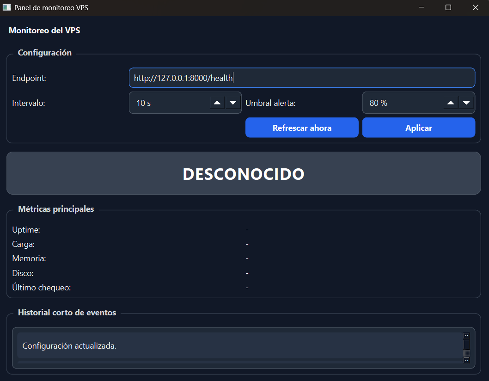
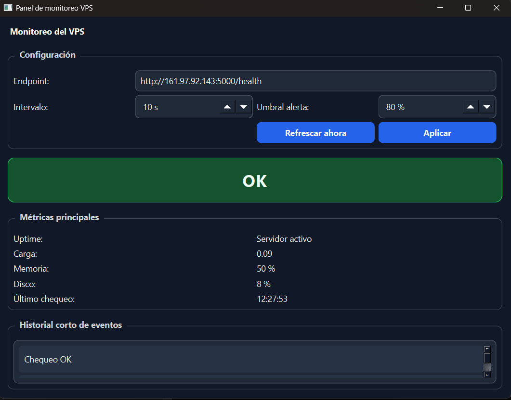
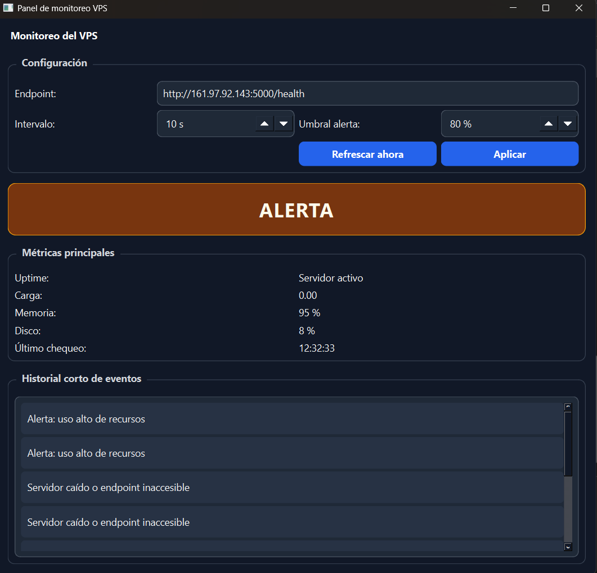
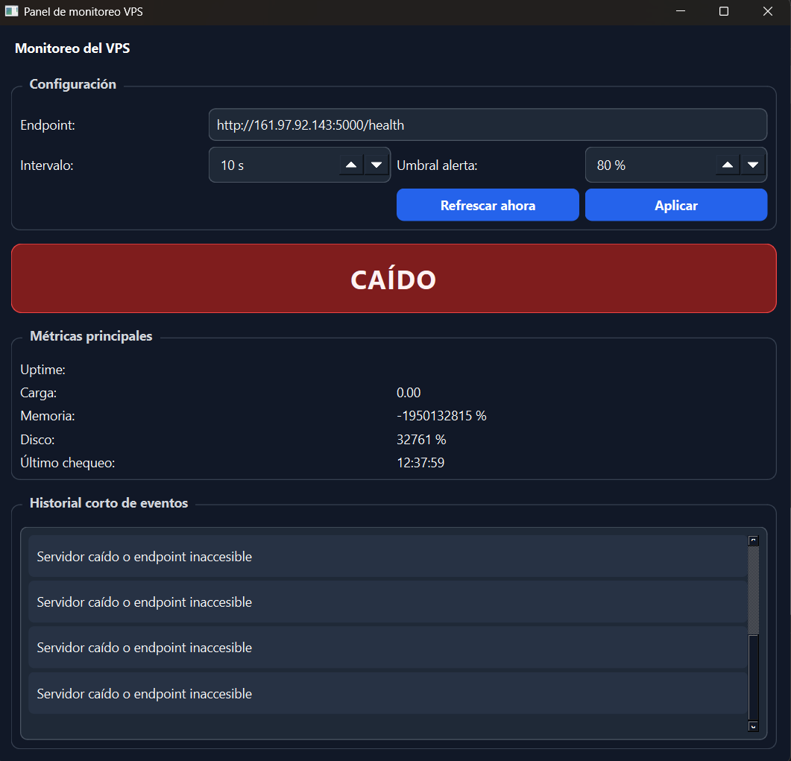
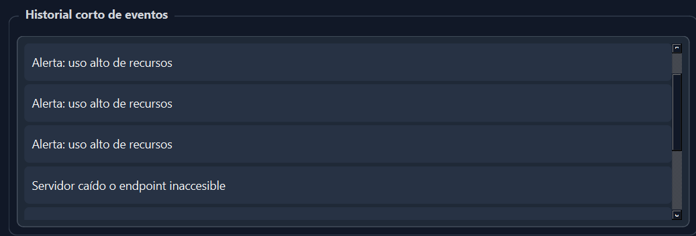
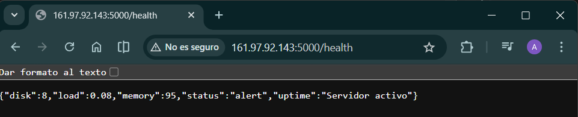
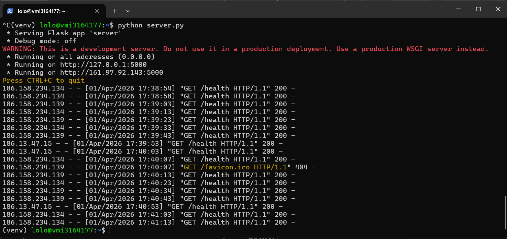

# Ejercicio 02 - Panel de Monitoreo VPS

Aplicación desarrollada en **C++ con Qt (QWidget)** que permite monitorear el estado de un servidor en la nube (VPS) mediante el consumo de un endpoint HTTP.

---

## Enunciado

El objetivo del ejercicio es desarrollar una aplicación de escritorio que:

- Consulte un endpoint en un servidor VPS
- Muestre el estado del servidor
- Visualice métricas (carga, memoria, disco, uptime)
- Permita interacción mediante controles
- Incluya historial de eventos
- Utilice Qt Widgets (sin QML)

---

## Objetivo del proyecto

Construir un panel visual que permita:

- Monitorear un servidor real
- Interpretar datos en formato JSON
- Detectar estados del sistema (OK, ALERTA, CAÍDO)
- Configurar intervalos y umbrales de monitoreo

---

## Tecnologías utilizadas

- C++
- Qt (QWidget)
- JSON
- QNetworkAccessManager
- QTimer
- Python + Flask (VPS)
- SSH

---

## Estructura del proyecto

Ejercicio02/
- codigo/ lógica de la aplicación
- VPS/ uso del VPS
- capturas/ evidencias del funcionamiento

---

## Funcionalidades principales

- Consulta a un endpoint HTTP
- Procesamiento de respuesta JSON
- Visualización de estado del servidor:
  - OK
  - ALERTA
  - CAÍDO
- Visualización de métricas:
  - uptime
  - carga
  - memoria
  - disco
- Refresco manual
- Configuración de intervalo
- Configuración de umbral
- Historial de eventos

---

## Arquitectura

### MainWindow
Encargada de la interfaz gráfica y visualización de datos.

### MonitorService
Encargada de:
- realizar requests HTTP
- procesar JSON
- manejar el timer
- emitir señales
- generar eventos

---

## Implementación del VPS

Se utilizó un servidor VPS con un endpoint `/health` que devuelve información del estado del sistema.

---

## Funcionamiento de la aplicación

###  Panel general
Vista principal con métricas del servidor.

---

###  Estado OK
El servidor funciona correctamente.

---

###  Estado ALERTA
Valores fuera del umbral.

---

### Estado CAÍDO
El servidor no responde.

---

###  Historial
Registro de eventos del sistema.

---

###  Endpoint en el VPS
Respuesta del servidor.

---

###  Conexión SSH al VPS
Acceso al servidor.

---

##  Consideraciones

- Se utilizó un servidor real (VPS)
- Se implementó comunicación cliente-servidor
- Arquitectura modular
- Interfaz clara inspirada en sistemas profesionales

---

##  Autor

Avril Ogas  
Ingeniería en Informática
