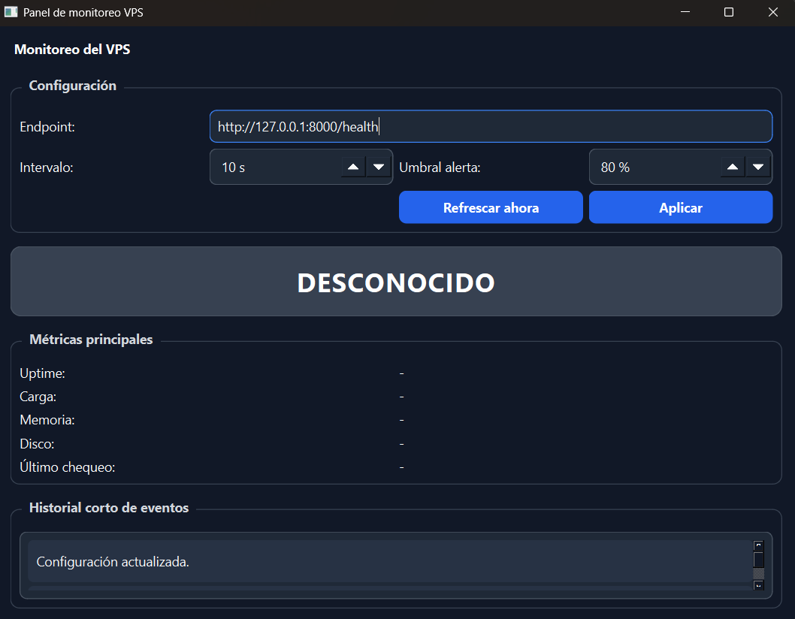
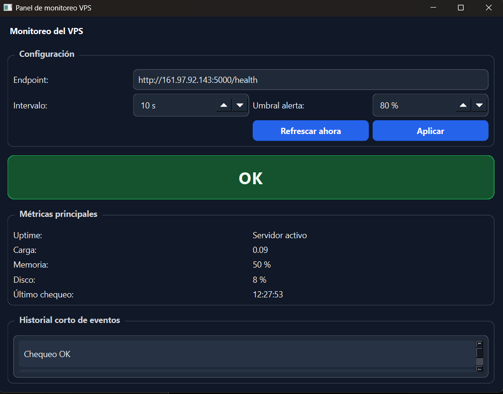
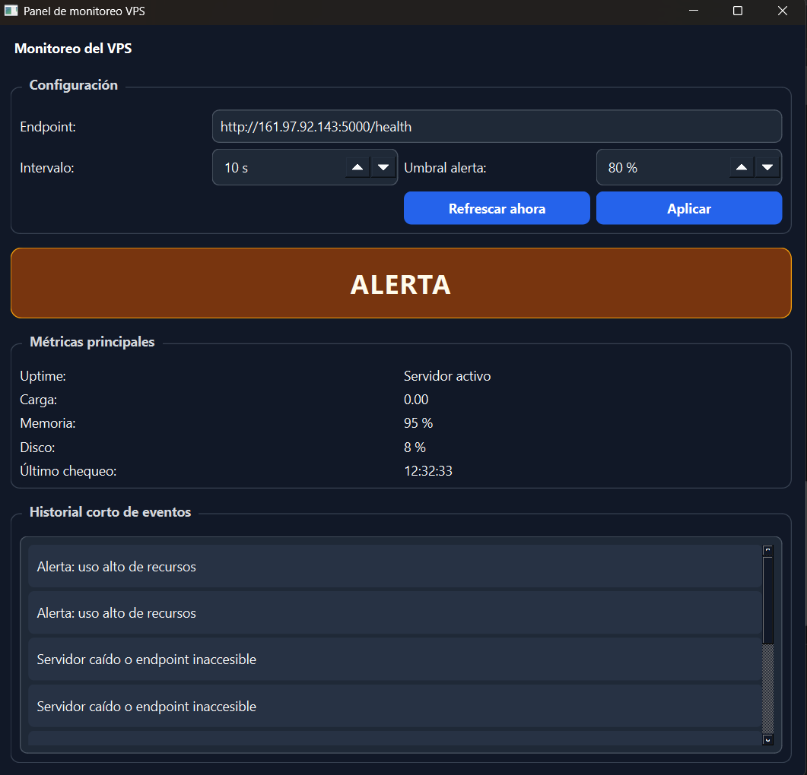
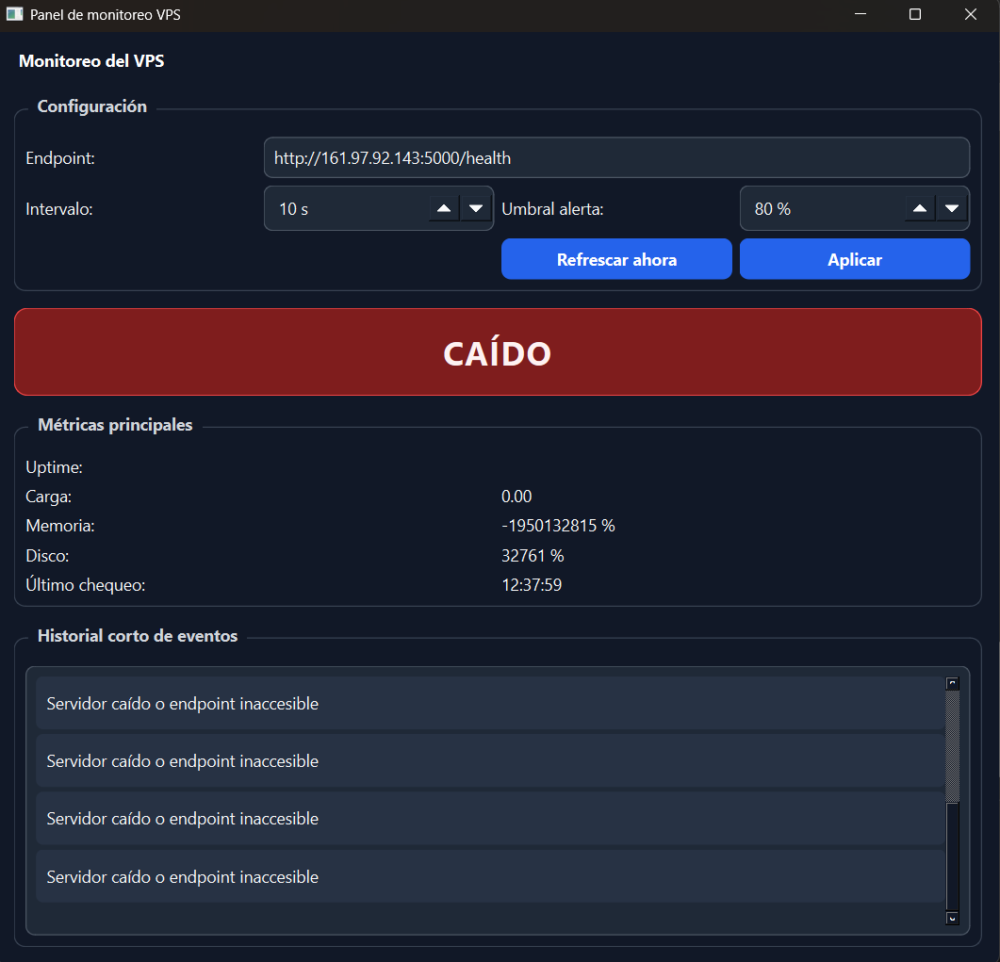
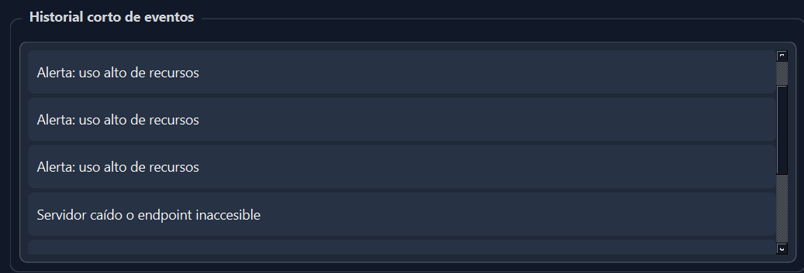
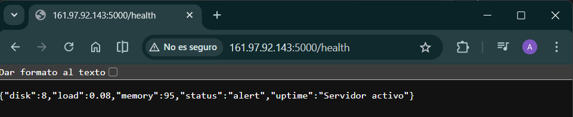
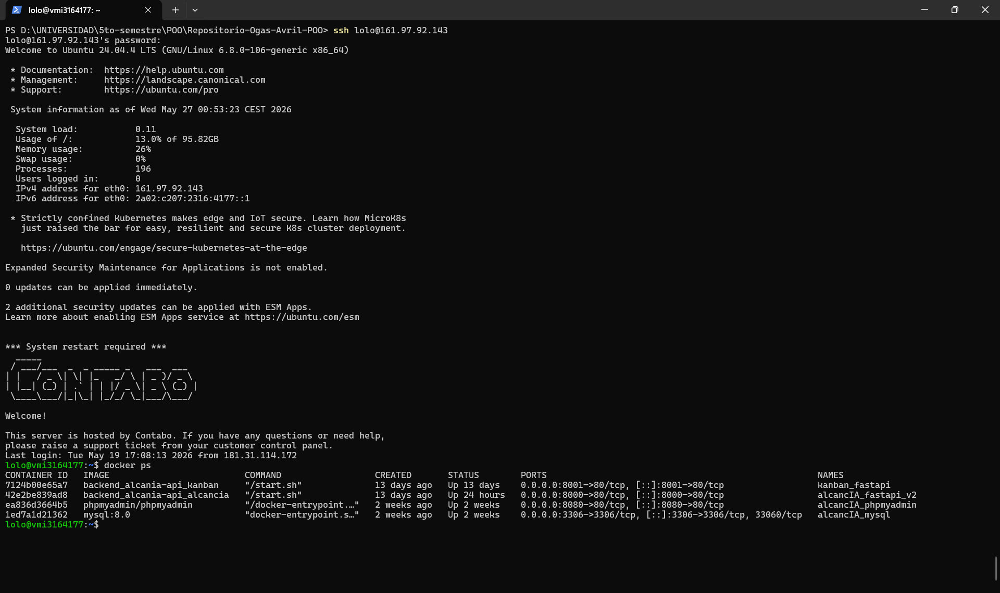

# Ejercicio 02 - Panel de Monitoreo VPS

## Descripción

Aplicación desarrollada en C++ utilizando Qt Widgets que permite monitorear el estado de un servidor VPS mediante el consumo de un endpoint HTTP.

El sistema consulta métricas del servidor en tiempo real, procesa respuestas JSON y muestra información del estado general del sistema a través de una interfaz gráfica inspirada en paneles de monitoreo profesionales.

---

## Objetivos del ejercicio

Desarrollar una aplicación de escritorio que permita:

- Consultar un endpoint en un VPS
- Visualizar métricas del sistema
- Detectar estados del servidor
- Configurar intervalos y umbrales
- Registrar historial de eventos
- Implementar comunicación cliente-servidor utilizando Qt

---

## Funcionalidades principales

- Consulta periódica a un endpoint HTTP
- Procesamiento de respuestas JSON
- Visualización de estado del servidor:
  - OK
  - ALERTA
  - CAÍDO
- Monitoreo de:
  - Uptime
  - Carga
  - Memoria
  - Disco
- Refresco manual
- Configuración de intervalos
- Configuración de umbrales
- Historial de eventos
- Actualización automática mediante `QTimer`

---

## Tecnologías utilizadas

- C++
- Qt Widgets
- QNetworkAccessManager
- JSON
- QTimer
- Python
- Flask
- SSH
- VPS Linux

---

## Arquitectura

### `MainWindow`

Clase encargada de:

- Interfaz gráfica
- Visualización de métricas
- Estado visual del sistema
- Controles interactivos

### `MonitorService`

Clase encargada de:

- Realizar requests HTTP
- Procesar respuestas JSON
- Manejar timers
- Emitir señales
- Generar eventos

---

## Implementación del VPS

Se utilizó un servidor VPS real con un endpoint `/health` encargado de devolver información del estado del sistema.

### Datos monitoreados

- Uptime
- Uso de memoria
- Uso de disco
- Carga del sistema
- Estado general

---

## Comunicación cliente-servidor

La aplicación utiliza `QNetworkAccessManager` para consultar el endpoint HTTP alojado en el VPS.

```text
Aplicación Qt → Endpoint VPS → Respuesta JSON
```

---

## Estructura del proyecto

```text
ejercicio02-Ogas/
│
├── codigo/
├── datos/
├── vps/
├── capturas/
└── README.md
```

---

## Funcionamiento de la aplicación

### Panel general

Vista principal con métricas del servidor.



---

### Estado OK

Servidor funcionando correctamente.



---

### Estado ALERTA

Valores fuera de umbral.



---

### Estado CAÍDO

El servidor no responde.



---

### Historial

Registro de eventos del sistema.



---

### Endpoint VPS

Respuesta del endpoint `/health`.



---

### Conexión SSH

Acceso remoto al VPS.



---

## Consideraciones

- Se utilizó un servidor VPS real
- Se implementó comunicación cliente-servidor
- Se utilizó arquitectura modular
- La interfaz se inspiró en sistemas de monitoreo profesionales

---

## Compilación y ejecución

1. Abrir el archivo `.pro` desde Qt Creator.
2. Configurar el kit de compilación.
3. Ejecutar el proyecto.
4. Verificar que el endpoint del VPS esté activo.

---

## Estado

✔ Ejercicio completado

---

## Autor

**Avril Ogas**  
Ingeniería en Informática