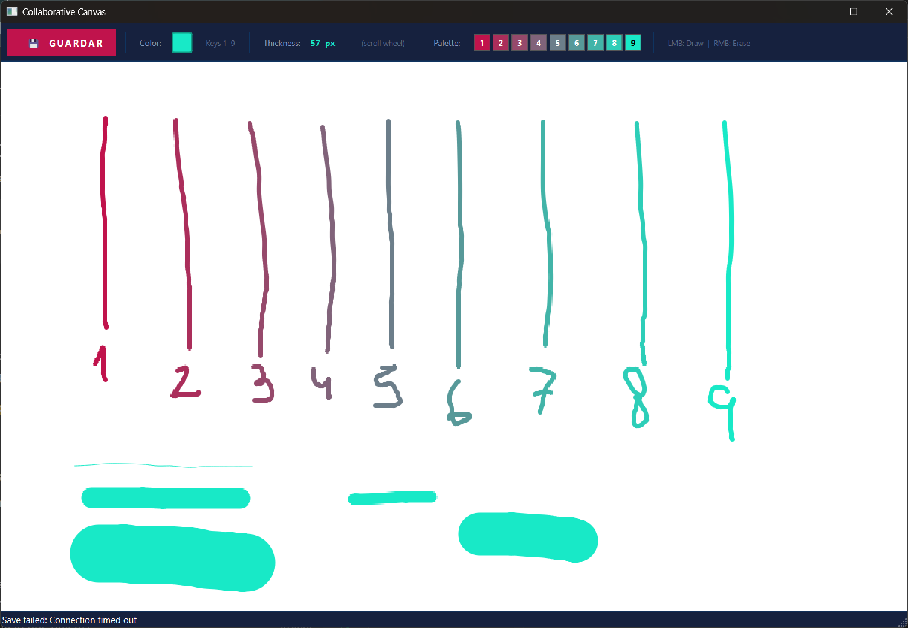
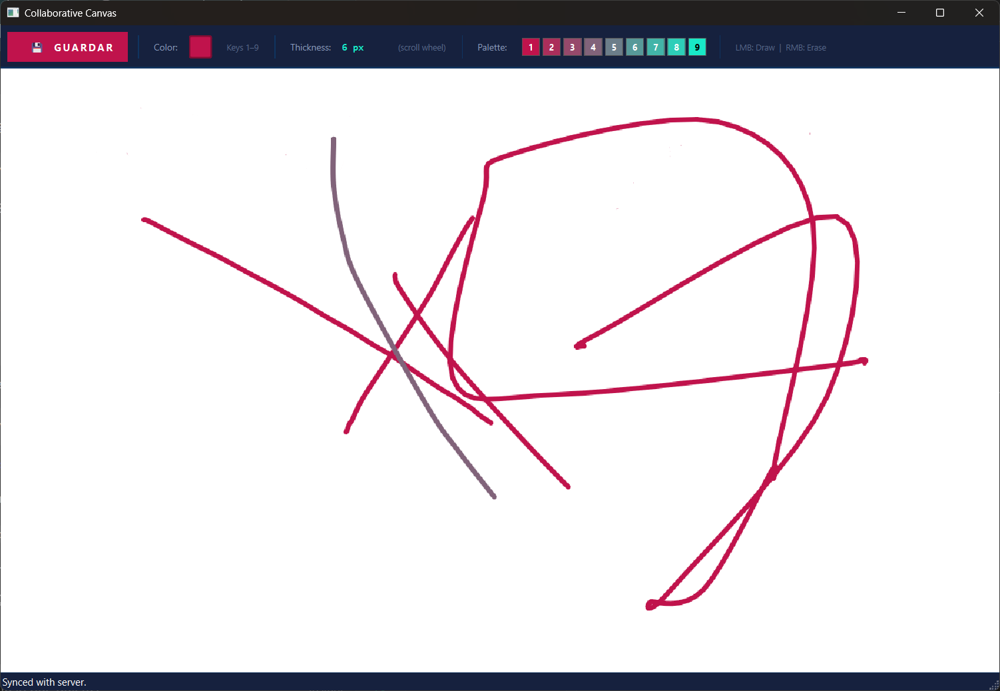
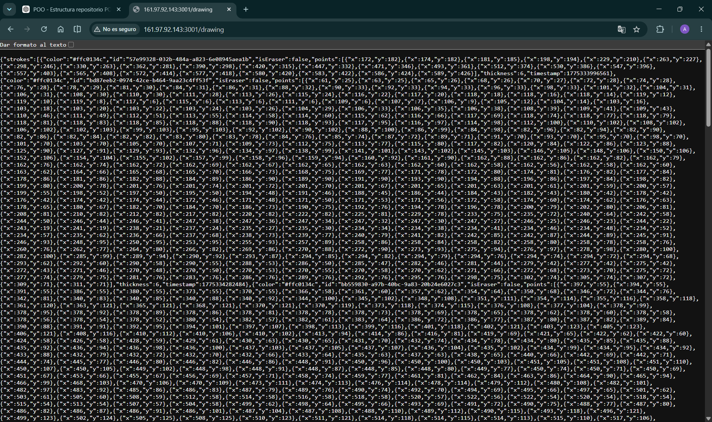

# Ejercicio 03 - Lienzo Colaborativo en Tiempo Real

## Descripción

Aplicación colaborativa desarrollada en C++ utilizando Qt Widgets que permite dibujar a mano alzada sobre un lienzo compartido en tiempo real.

El sistema implementa sincronización mediante un backend conectado a un VPS, permitiendo que múltiples usuarios puedan visualizar y continuar editando el mismo dibujo sin pérdida de información.

El objetivo principal del ejercicio es aplicar renderizado gráfico, sincronización cliente-servidor, modularización y manejo de eventos utilizando Qt.

---

## Funcionalidades principales

- Dibujo libre a mano alzada
- Suavizado e interpolación de trazos
- Cambio dinámico de color
- Cambio dinámico de grosor
- Herramienta de borrado
- Sincronización colaborativa mediante VPS
- Persistencia remota de trazos
- Recuperación automática del dibujo
- Merge incremental sin pérdida de información
- Toolbar superior estilo Metro

---

## Controles

| Acción              | Control                      |
|---------------------|------------------------------|
| Dibujar             | Click izquierdo + arrastrar  |
| Borrar              | Click derecho + arrastrar    |
| Cambiar color       | Teclas 1 al 9                |
| Cambiar grosor      | Rueda del mouse              |
| Guardar al servidor | Botón GUARDAR                |

---

## Paleta de colores

La selección de colores se realiza mediante interpolación lineal entre:

```txt
RGB inicial → (192, 19, 76)
RGB final   → (24, 233, 199)
```

---

## Arquitectura

### `DrawingModel`

Responsable de:

- Almacenamiento de trazos
- Interpolación de puntos
- Merge incremental
- Gestión de UUIDs

### `CanvasView`

Responsable de:

- Renderizado mediante `paintEvent`
- Dibujo dinámico
- Overlay de trazos en curso

### `SyncManager`

Responsable de:

- Comunicación con el VPS
- Requests HTTP
- Polling automático
- Sincronización colaborativa

### `MainWindow`

Responsable de:

- Interfaz principal
- Toolbar
- Integración general de componentes

---

## Estrategia de sincronización

Cada trazo posee un UUID único.

El cliente y el servidor únicamente agregan trazos desconocidos, evitando sobrescribir información y garantizando sincronización sin pérdida de datos.

```text
Cliente Qt ↔ VPS ↔ Otros clientes
```

---

## Backend VPS

El backend fue desarrollado utilizando Node.js y Express.

### Endpoints principales

|     Método    |  Endpoint  |          Función          |
|---------------|------------|---------------------------|
| `GET`         | `/drawing` | Recuperar trazos          |
| `POST`        | `/drawing` | Guardar y fusionar trazos |
| `DELETE`      | `/drawing` | Limpiar canvas            |
| `GET`         | `/health`  | Estado del servidor       |

---

## Tecnologías utilizadas

- C++
- Qt Widgets
- QPainter
- QNetworkAccessManager
- Node.js
- Express
- VPS Linux
- JSON
- Programación Orientada a Objetos

---

## Estructura del proyecto

```text
ejercicio03-Ogas-Poletto-Agostini/
│
├── codigo/
├── backend/
├── capturas/
└── README.md
```

---

## Compilación del cliente Qt

Requisitos:

- Qt 5.15+ o Qt 6.x
- Módulos:
  - core
  - gui
  - widgets
  - network
- C++17

```bash
qmake collaborative_canvas.pro
make
```

---

## Ejecución del backend

```bash
cd backend
npm install
node server.js
```

---

## Capturas

### Lienzo colaborativo



### Toolbar y controles


### Sincronización con servidor



### JSON del servidor



---

## Estado

✔ Ejercicio completado

---

## Autores

- **Agostini, Santiago**
- **Ogas, Avril**
- **Poletto, Lorenzo**