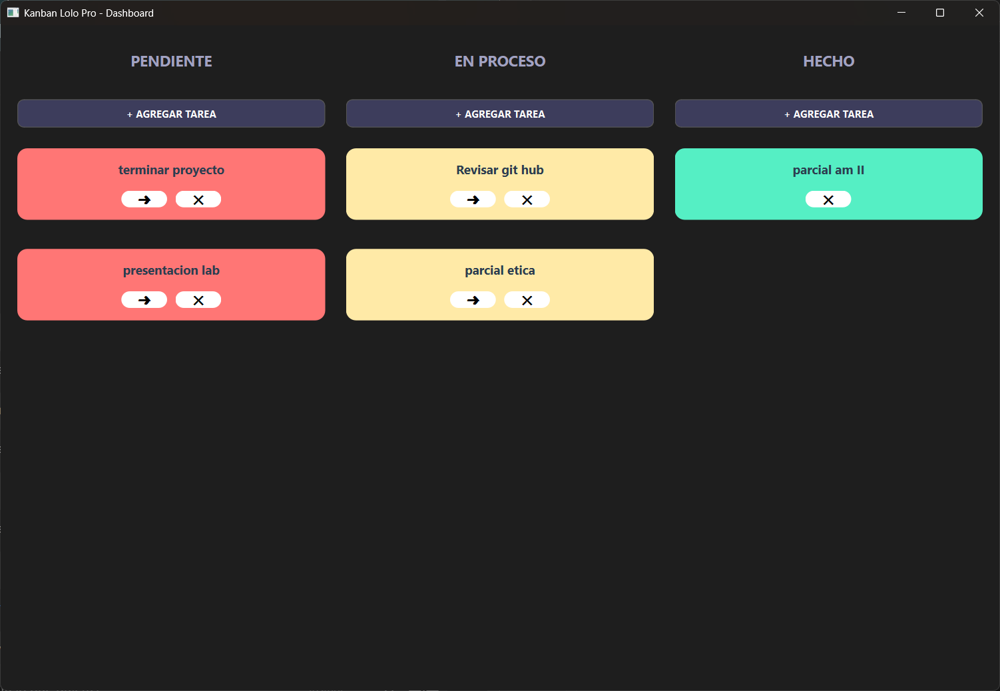

# Ejercicio 04 - Tablero Kanban Colaborativo

## Descripción

Aplicación colaborativa desarrollada en C++ utilizando Qt Widgets para gestionar tareas mediante un sistema Kanban en tiempo real.

El sistema implementa una arquitectura cliente-servidor donde múltiples clientes Qt se sincronizan con un backend desarrollado en FastAPI, utilizando persistencia en MySQL sobre un VPS administrado mediante Docker.

El objetivo principal del ejercicio es aplicar conceptos de comunicación cliente-servidor, sincronización colaborativa, persistencia remota y arquitectura modular.

---

## Funcionalidades principales

- Sistema Kanban colaborativo
- CRUD completo de tarjetas
- Movimiento de tarjetas entre columnas
- Sincronización automática mediante polling
- Persistencia en MySQL
- Comunicación HTTP asíncrona
- Actualización dinámica de interfaz
- Confirmación de eliminación
- Interfaz moderna con QSS
- Colores dinámicos según estado

---

## Estados del tablero

| Estado | Color |
|---|---|
| Pendiente | `#ff7675` |
| En Proceso | `#ffeaa7` |
| Hecho | `#55efc4` |

---

## Tecnologías utilizadas

### Backend

- Python 3.11
- FastAPI
- MySQL 8
- Docker
- Docker Compose
- phpMyAdmin
- VPS Linux

### Frontend

- C++17
- Qt Widgets
- QNetworkAccessManager
- JSON
- QSS (Qt Style Sheets)

---

## Arquitectura

### Cliente Qt

Responsable de:

- Interfaz gráfica
- Comunicación HTTP
- Actualización dinámica
- Renderizado del tablero
- Gestión de tarjetas

### Backend FastAPI

Responsable de:

- API REST
- Persistencia de datos
- Gestión de tarjetas y columnas
- Comunicación con MySQL

### Base de datos

Responsable de:

- Persistencia de tarjetas
- Estados
- Orden de columnas
- Información colaborativa

---

## Sincronización colaborativa

El sistema implementa polling automático cada 3 segundos utilizando `QTimer` y `QNetworkAccessManager`.

```text
Cliente Qt ↔ FastAPI ↔ MySQL ↔ Otros clientes
```

Esto permite mantener el tablero actualizado entre múltiples usuarios sin bloquear la interfaz.

---

## Desafíos técnicos

### Gestión de memoria en C++

Se implementó limpieza dinámica de widgets utilizando:

- `deleteLater()`
- `hide()`

para evitar errores de segmentación durante la actualización asíncrona de la interfaz.

### Comunicación asíncrona

Uso de `QNetworkAccessManager` para evitar bloqueos de interfaz durante requests HTTP.

### Configuración CORS

Se configuraron middlewares CORS en FastAPI para permitir conexiones desde diferentes clientes y redes.

---

## Estructura del proyecto

```text
ejercicio04-Ogas-Poletto-Agostini/
│
├── codigo/
├── backend/
├── capturas/
└── README.md
```

---

## Backend VPS

El backend fue desplegado sobre un VPS utilizando Docker y Docker Compose.

### Componentes principales

| Archivo | Función |
|---|---|
| `main.py` | API REST FastAPI |
| `Dockerfile` | Imagen del backend |
| `docker-compose.yml` | Orquestación de contenedores |
| `requirements.txt` | Dependencias Python |

---

## Capturas

### Tablero Kanban


### Movimiento de tarjetas


### Estados dinámicos



### Backend y VPS


---

## Compilación y ejecución

### Cliente Qt

1. Abrir el archivo `.pro` desde Qt Creator.
2. Ejecutar `Run qmake`.
3. Configurar el kit de compilación.
4. Ejecutar la aplicación.

### Backend

```bash
docker compose up -d
```

La aplicación se conecta automáticamente al endpoint configurado en el VPS.

---

## Estado

✔ Ejercicio completado

---

## Autores

- **Agostini Santiago**
- **Ogas Avril**
- **Poletto Lorenzo**
