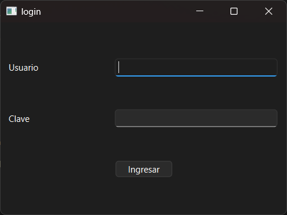

# Ejercicio 06 - Login con Qt Designer

## Descripción

Aplicación de login desarrollada utilizando Qt Designer para la creación visual de la interfaz gráfica.

A diferencia del ejercicio anterior, la interfaz fue diseñada mediante archivos `.ui`, mientras que la lógica y validación del sistema fueron implementadas en C++ utilizando señales y slots.

---

## Funcionalidades principales

- Ingreso de usuario y contraseña
- Validación básica de credenciales
- Mensajes de acceso correcto e incorrecto
- Interfaz gráfica diseñada visualmente con Qt Designer
- Integración entre interfaz `.ui` y lógica en C++

---

## Tecnologías utilizadas

- C++
- Qt Widgets
- Qt Designer
- Qt Creator
- Signals & Slots

---

## Estructura del proyecto

```text
ejercicio06-Ogas/
│
├── codigo/
├── capturas/
├── multimedia/
└── README.md
```

---

## Archivos principales

- `main.cpp` → punto de inicio de la aplicación
- `login.h` → definición de la clase Login
- `login.cpp` → implementación de la lógica
- `login.ui` → diseño visual de la interfaz

---

## Video explicativo

- https://youtu.be/zWhEoJTPgaM

---

## Capturas

### Login con Qt Designer



---

## Compilación y ejecución

1. Abrir el archivo `.pro` desde Qt Creator.
2. Configurar el kit de compilación correspondiente.
3. Ejecutar el proyecto.

---

## Estado

✔ Ejercicio completado

---

## Autor

**Avril Ogas**  
Ingeniería en Informática