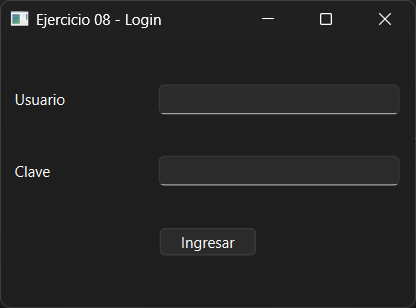
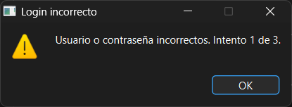
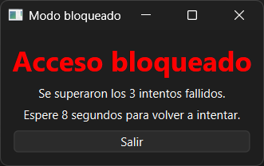
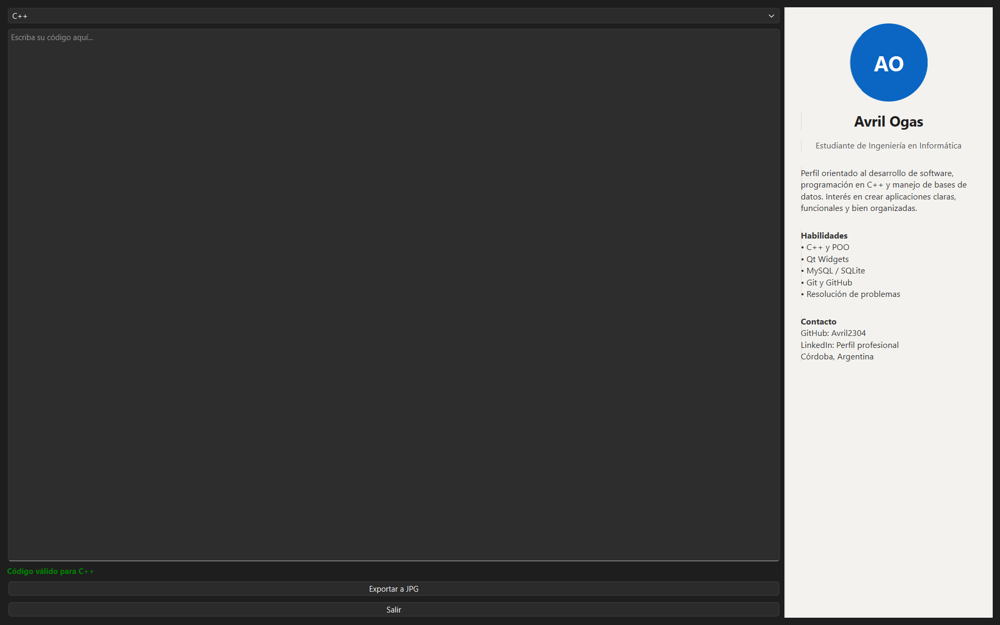

# Ejercicio 08 - Editor Multilenguaje

## Descripción

Aplicación de escritorio desarrollada en C++ utilizando Qt Widgets.

El sistema implementa un login con validación de usuario, control de intentos fallidos y un editor multilenguaje con validación sintáctica básica para C++, Python y Java.

El objetivo principal del ejercicio es aplicar conceptos avanzados de Programación Orientada a Objetos utilizando herencia, polimorfismo, clases abstractas, redefinición de eventos y persistencia local mediante archivos.

---

## Usuario de prueba

```txt
Usuario: admin
Contraseña: 1234
```

Las credenciales pueden configurarse desde:

```txt
datos/config.txt
```

---

## Funcionalidades principales

- Login inicial con usuario y contraseña
- Bloqueo temporal tras 3 intentos fallidos
- Editor principal en pantalla completa
- Selector de lenguaje:
  - C++
  - Python
  - Java
- Validación de sintaxis por línea
- Resaltado de errores en rojo
- Mensajes amigables en la interfaz
- Exportación del código a JPG
- Panel lateral estilo LinkedIn
- Persistencia mediante archivos locales
- Funcionamiento completamente offline

---

## Arquitectura orientada a objetos

### Clase base abstracta

- `Pantalla`

### Clases derivadas

- `Login`
- `EditorPrincipal`
- `ModoBloqueado`

La aplicación utiliza polimorfismo mediante punteros y referencias a la clase base `Pantalla`.

---

## Jerarquía de validadores

### Clase abstracta

- `ValidadorSintaxis`

### Clases derivadas

- `ValidadorCpp`
- `ValidadorPython`
- `ValidadorJava`

Cada validador implementa reglas básicas de validación sintáctica según el lenguaje seleccionado.

---

## Redefinición de eventos Qt

Se redefinieron distintos eventos para adaptar el comportamiento de cada pantalla:

- `keyPressEvent`
- `mousePressEvent`
- `resizeEvent`
- `closeEvent`
- `focusInEvent`
- `focusOutEvent`

---

## Signals & Slots

Se utilizó el sistema de señales y slots de Qt para:

- Comunicación entre componentes
- Validación dinámica
- Actualización de interfaz
- Manejo de eventos del editor

---

## Configuración

Archivo `config.txt`:

```txt
usuario=admin
password=1234
tiempo_bloqueo=10
lenguaje_defecto=C++
ruta_exportacion=datos/codigo_exportado.jpg
```

---

## Registro de eventos

La aplicación registra acciones importantes en:

```txt
datos/eventos.log
```

### Ejemplos de eventos registrados

```txt
Login correcto
Intento fallido de login
Usuario bloqueado temporalmente
Cambio de lenguaje
Error de sintaxis
Código exportado a JPG
Editor cerrado
```

---

## Exportación

El botón **Exportar a JPG** genera una imagen que contiene todo el código escrito en el editor, respetando saltos de línea y formato visual.

---

## Tecnologías utilizadas

- C++
- Qt Widgets
- Qt Designer
- Signals & Slots
- Programación Orientada a Objetos
- Herencia y Polimorfismo
- Persistencia mediante archivos locales

---

## Estructura del proyecto

```text
ejercicio08-Ogas/
│
├── codigo/
├── capturas/
├── multimedia/
└── README.md
```

---

## Capturas

### Login



### Intentos fallidos



### Modo bloqueado



### Pantalla principal



---

## Compilación y ejecución

1. Abrir el archivo `.pro` desde Qt Creator.
2. Configurar el kit de compilación.
3. Ejecutar el proyecto.

---

## Estado

✔ Ejercicio completado

---

## Autor

**Avril Ogas**  
Ingeniería en Informática
