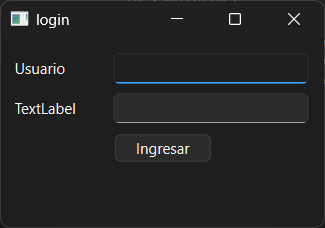

# Ejercicio 09 - Coordenadas en Base de Datos

## Descripción

Aplicación de escritorio desarrollada en C++ utilizando Qt Widgets y SQLite.

El sistema permite iniciar sesión mediante usuarios almacenados en una base de datos SQLite y acceder a un lienzo de dibujo libre. Cada trazo realizado se almacena utilizando coordenadas, color y grosor, permitiendo reconstruir automáticamente el dibujo al reiniciar la aplicación.

El objetivo principal del ejercicio es integrar persistencia local, eventos de Qt y manejo de bases de datos utilizando Qt SQL.

---

## Funcionalidades principales

- Login desarrollado con Qt Designer
- Validación de usuarios contra SQLite
- Registro de accesos e intentos fallidos en archivo de log
- Lienzo de dibujo implementado con `QWidget`
- Dibujo libre mediante mouse
- Cambio dinámico de grosor
- Cambio de color mediante teclado
- Persistencia de trazos y coordenadas
- Reconstrucción automática del dibujo
- Deshacer acciones (`Ctrl + Z`)
- Limpieza completa del lienzo

---

## Usuario de prueba

```txt
Usuario: admin
Contraseña: 1234
```

---

## Base de datos SQLite

La base de datos utilizada es:

```txt
datos/dibujos.db
```

### Tablas principales

```txt
usuarios
trazos
coordenadas
```

---

## Estructura de tablas

```sql
CREATE TABLE usuarios (
    id_usuario INTEGER PRIMARY KEY AUTOINCREMENT,
    usuario TEXT NOT NULL UNIQUE,
    password TEXT NOT NULL
);

CREATE TABLE trazos (
    id_trazo INTEGER PRIMARY KEY AUTOINCREMENT,
    id_usuario INTEGER NOT NULL,
    color TEXT NOT NULL,
    grosor INTEGER NOT NULL,
    fecha TEXT NOT NULL,
    FOREIGN KEY (id_usuario) REFERENCES usuarios(id_usuario)
);

CREATE TABLE coordenadas (
    id_coord INTEGER PRIMARY KEY AUTOINCREMENT,
    id_trazo INTEGER NOT NULL,
    x INTEGER NOT NULL,
    y INTEGER NOT NULL,
    orden_punto INTEGER NOT NULL,
    FOREIGN KEY (id_trazo) REFERENCES trazos(id_trazo)
);
```

---

## Controles del lienzo

| Acción | Control |
|---|---|
| Dibujar | Click izquierdo + mover mouse |
| Aumentar/disminuir grosor | Rueda del mouse |
| Color rojo | Tecla `R` |
| Color verde | Tecla `G` |
| Color azul | Tecla `B` |
| Borrar lienzo | `Escape` |
| Deshacer | `Ctrl + Z` |

---

## Clases principales

| Clase | Responsabilidad |
|---|---|
| `Login` | Pantalla inicial y validación de usuario |
| `Ventana` | Ventana principal que contiene el lienzo |
| `Pintura` | Widget de dibujo libre |
| `Database` | Persistencia y consultas SQLite |
| `Logger` | Registro de eventos en archivos |

---

## Configuración del proyecto

El archivo `.pro` debe incluir:

```pro
QT += core gui widgets sql

CONFIG += c++17
```

---

## Logs

Los accesos se registran en:

```txt
logs/accesos.log
```

### Ejemplos de registros

```txt
[2026-05-19 18:30:10] ACCESO EXITOSO - usuario: admin
[2026-05-19 18:32:41] INTENTO FALLIDO - usuario: admin
```

---

## Tecnologías utilizadas

- C++
- Qt Widgets
- Qt Designer
- Qt SQL
- SQLite
- Signals & Slots
- Persistencia local

---

## Estructura del proyecto

```text
ejercicio09-Ogas/
│
├── codigo/
├── capturas/
├── datos/
└── README.md
```

---

## Capturas

### Login



### Lienzo de dibujo


### Persistencia de dibujo


---

## Compilación y ejecución

1. Abrir el archivo `.pro` desde Qt Creator.
2. Verificar que exista la base `dibujos.db`.
3. Configurar el kit de compilación.
4. Ejecutar el proyecto.

---

## Estado

✔ Ejercicio completado

---

## Autor

**Avril Ogas**  
Ingeniería en Informática