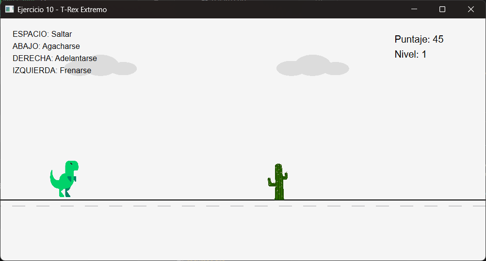

# Ejercicio 10 - T-Rex Extremo

## Descripción

Aplicación desarrollada en C++ utilizando Qt Widgets, inspirada en el clásico juego del T-Rex de Google Chrome.

El jugador controla un dinosaurio que debe esquivar cactus y pájaros utilizando eventos de teclado, temporizadores y detección de colisiones.

El objetivo principal del ejercicio es aplicar conceptos de programación orientada a objetos, modularización, manejo de eventos y renderizado gráfico utilizando Qt.

---

## Funcionalidades principales

- Movimiento del dinosaurio mediante teclado
- Sistema de salto y agacharse
- Obstáculos terrestres y aéreos
- Detección de colisiones
- Sistema de Game Over
- Reinicio de partida
- Aparición dinámica de pájaros
- Aumento progresivo de dificultad
- Renderizado mediante `QPainter`
- Uso de recursos gráficos con `.qrc`

---

## Objetivos del ejercicio

Implementar un juego de escritorio aplicando:

- Herencia
- Modularización de clases
- Eventos de teclado
- Temporizadores con `QTimer`
- Detección de colisiones
- Renderizado gráfico
- Manejo de recursos Qt

---

## Controles

|       Tecla      |             Acción             |
|------------------|--------------------------------|
| Espacio          | Saltar                         |
| Flecha abajo     | Agacharse                      |
| Flecha derecha   | Adelantarse                    |
| Flecha izquierda | Frenarse                       |
| R                | Reiniciar luego del Game Over  |

## Clases principales

|    Clase    |                        Responsabilidad                        |
|-------------|---------------------------------------------------------------|
| `Juego`     | Ventana principal, renderizado, timers generales y colisiones |
| `TRex`      | Controla posición, salto, agacharse y movimiento horizontal   |
| `Obstaculo` | Clase base abstracta para obstáculos                          |
| `Cactus`    | Obstáculo terrestre controlado por el timer principal         |
| `Pajaro`    | Obstáculo aéreo con `QTimer` independiente por instancia      |
---

## Funcionamiento general

La clase `Juego` hereda de `QWidget` y utiliza `paintEvent()` para renderizar:

- Escenario
- Dinosaurio
- Obstáculos
- Puntaje
- Estado de Game Over

El juego utiliza un `QTimer` principal encargado de:

- Movimiento del escenario
- Actualización del puntaje
- Detección de colisiones
- Control de dificultad
- Actualización de estados

Cada pájaro posee su propio `QTimer`, permitiendo movimiento independiente entre instancias.

Además, cada ciertos segundos aparece un nuevo pájaro con altura aleatoria.

---

## Dificultad progresiva

A medida que aumenta el puntaje:

- Incrementa la velocidad del juego
- Los obstáculos aparecen más rápido
- El movimiento se vuelve más dinámico

Esto genera un aumento progresivo de dificultad durante la partida.

---

## Recursos gráficos

Las imágenes se gestionan mediante el sistema de recursos de Qt utilizando un archivo `.qrc`.

```pro
RESOURCES += recursos.qrc
```

Esto permite incluir imágenes directamente dentro del ejecutable sin depender de rutas externas.

---

## Tecnologías utilizadas

- C++
- Qt Widgets
- QTimer
- QPainter
- QKeyEvent
- Qt Resource System (`.qrc`)
- Programación Orientada a Objetos

---

## Estructura del proyecto

```text
ejercicio10-Ogas/
│
├── codigo/
├── recursos/
├── capturas/
└── README.md
```

---

## Capturas

### Gameplay



### Game Over


### Obstáculos y pájaros


---

## Compilación y ejecución

1. Abrir el archivo `.pro` desde Qt Creator.
2. Ejecutar `Run qmake`.
3. Configurar el kit de compilación.
4. Compilar el proyecto.
5. Ejecutar la aplicación.

---

## Estado

✔ Ejercicio completado

---

## Autor

**Avril Ogas**  
Ingeniería en Informática